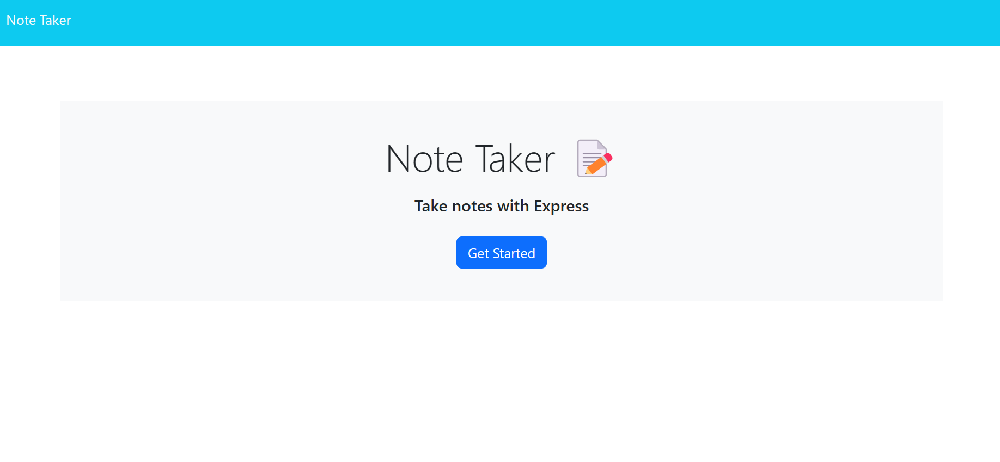
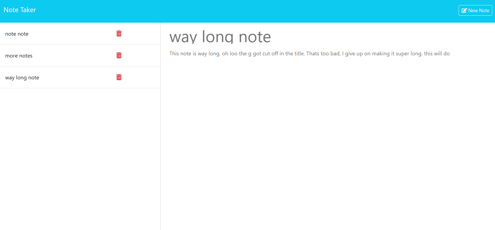

# Note Taker 
## Description 
 A simple app for taking notes built with a backend using node and express
## Table of Contents
[Installation](#installation)

[Usage](#usage)

[Screenshot](#screenshot)

[License](#license)

[Contact](#contact)

[Deployed](#deployed)

## Installation 
```bash
npm i 
```
to install teh needed modules
## Usage 
start the server locally by running
```bash 
npm run start
```
 Then load up the page and make notes and delete notes with ease
## Screenshot 


## License 

## Deployed
https://note-taker-v0g3.onrender.com
## Contact 
 Ask me questions about the project here
* Github: Ownerman123
* Email: charlesshumway1@gmail.com
